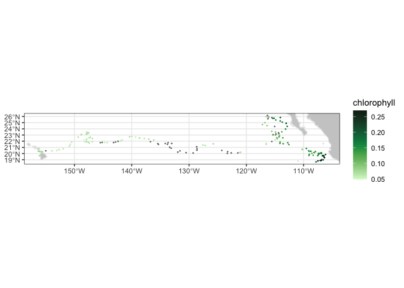
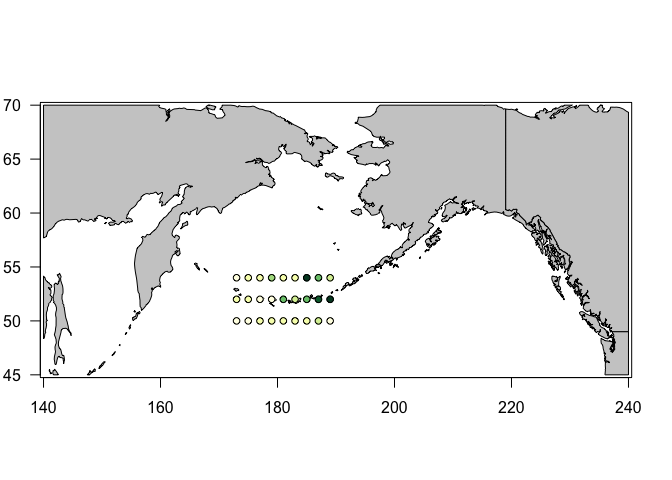
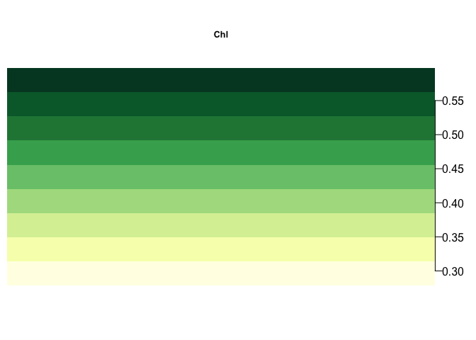

# Matchups to ship or animal tracks

> notebook filename \| matchup\_satellite\_track\_data.Rmd  
> history \| Created May 2021 - converted to R notebook from
> xyt\_matchup.R

This exercise you will extract satellite data around a set of points
defined by longitude, latitude, and time coordinates like that produced
by an animal telemetry tag, and ship track, or a glider tract.

The exercise demonstrates the following techniques:

-   Using the **rxtracto** function to extract satellite data along a
    track  
-   Using **rerddap** to retrieve information about a dataset from
    ERDDAP  
-   Using **plotTrack** to plot the satellite data onto a map as well as
    to make an animation
-   Loading data from a tab separated file  
-   Plotting the satellite data onto a map

This data is taken from the ERDDAP server at
<http://coastwatch.pfeg.noaa.gov/erddap/>

## Install required packages and load libraries

``` r
# Function to check if pkgs are installed, and install any missing pkgs

pkgTest <- function(x)
{
  if (!require(x,character.only = TRUE))
  {
    install.packages(x,dep=TRUE,repos='http://cran.us.r-project.org')
    if(!require(x,character.only = TRUE)) stop(x, " :Package not found")
  }
}

# create list of required packages
list.of.packages <- c("ncdf4", "rerddap", "plotdap", "parsedate",
                      "graphics", "maps", "mapdata", "RColorBrewer", "ggplot2", "gifski",
                      "png", "rerddapXtracto")

# create list of installed packages
pkges = installed.packages()[,"Package"]

# Install and load all required pkgs
for (pk in list.of.packages) {
  pkgTest(pk)
}
```

## Get XYZ coordinates

In this exercise we willuse in the XYZ coordinates that have been
brought in from a file. Installation of the “rerddapXtracto” package
comes with the “Marlintag38606” dataset which we will use for this
exercise. It is the track of a tagged marlin in the Pacific Ocean
(courtesy of Dr. Mike Musyl of the Pelagic Research Group LLC).

The “Marlintag38606” file has this structure:

``` r
str(Marlintag38606)
```

    ## 'data.frame':    152 obs. of  7 variables:
    ##  $ date  : Date, format: "2003-04-23" "2003-04-24" ...
    ##  $ lon   : num  204 204 204 204 204 ...
    ##  $ lat   : num  19.7 19.8 20.4 20.3 20.3 ...
    ##  $ lowLon: num  204 204 204 204 204 ...
    ##  $ higLon: num  204 204 204 204 204 ...
    ##  $ lowLat: num  19.7 18.8 18.8 18.9 18.9 ...
    ##  $ higLat: num  19.7 20.9 21.9 21.7 21.7 ...

We will use the “date”, “lon” and “lat” variables to get the matching
satellite data. Here the time variable is already in a date format.
Often when reading in your own data you will have to convert the date
into a date format (Remember R syntax is Y for a 4 digit year and y for
a 2 digit year)

``` r
## For convenience make shorter names for the variables  
xcoord <- Marlintag38606$lon  
ycoord <- Marlintag38606$lat
tcoord <- Marlintag38606$date
```

## Select the dataset and download its metadata

For this example we will use the SeaWiFS 8-day composite chlorophyll
dataset (ID erdSW2018chla8day)

**The script below:**

-   Gathers information about the dataset (metadata) using **rerddap**  
-   Displays the information

**Set the following arguments for rerddap**

-   Set the dataset ID: dataset &lt;- ‘erdSW2018chla8day’

-   The default source ERDDAP for **rerddap** is
    “<https://upwell.pfeg.noaa.gov/erddap>”. Since we are pulling the
    data from the ERDDAP at “<http://coastwatch.pfeg.noaa.gov/erddap/>”,
    change the url to url = “<http://coastwatch.pfeg.noaa.gov/erddap/>”

``` r
dataset <- 'erdSW2018chla8day'
# Use rerddap to get dataset metadata 
# if you encouter an error reading the nc file clear the rerrdap cache: 
rerddap::cache_delete_all(force = TRUE)
dataInfo <- rerddap::info(dataset, url= "https://coastwatch.pfeg.noaa.gov/erddap/")
# Display the metadata
dataInfo
```

    ## <ERDDAP info> erdSW2018chla8day 
    ##  Base URL: https://coastwatch.pfeg.noaa.gov/erddap 
    ##  Dataset Type: griddap 
    ##  Dimensions (range):  
    ##      time: (1997-09-02T00:00:00Z, 2010-12-15T00:00:00Z) 
    ##      latitude: (-89.95834, 89.95834) 
    ##      longitude: (-179.9583, 179.9584) 
    ##  Variables:  
    ##      chlorophyll: 
    ##          Units: mg m^-3

## Extract the satellite data

-   Double check dataInfo to make sure the dataset covers the time,
    longitude, and latitude ranges in your XYT data.

-   Use the name of the chlorophyll parameter that was displayed above
    in dataInfo: **parameter &lt;- “chlorophyll”**

-   Use the xcoord, ycoord, and tcoord vectors you extracted from the
    marlin tag file.

-   Some datasets have an altitude dimension. If so, then zcood must be
    included in the rxtracto call. The “erdSW2018chla8day” dataset does
    not include an altitude dimension.

-   Define the search “radius” for the gridded data. The **rxtracto**
    function allow you to set the size of the box used to collect data
    around the track points using the xlen and ylen arguments. The
    values for xlen and ylen are in degrees. For our example we 0.2
    degrees for both arguments. Note: You can also submit vectors for
    xlen and ylen, as long as the are the same length as xcoord, ycoord,
    and tcoord

-   Run the rxtracto function to extract the data from ERDDAP.

``` r
parameter <- 'chlorophyll'

xlen <- 0.2 
ylen <- 0.2

# Some datasets have an altitude dimension. If so, then zcood must be included in the rxtracto call.  
# If the dataInfo shows an altitude dimension, uncomment "zcoord <- 0" and include zcoord=zcoord in the rxtracto call.
# zcoord <- 0.

swchl <- rxtracto(dataInfo, 
                  parameter=parameter, 
                  xcoord=xcoord, ycoord=ycoord, 
                  tcoord=tcoord, xlen=xlen, ylen=ylen)
```

After the extraction is complete, “swchl” will contain the following
columns.

``` r
str(swchl)
```

    ## List of 13
    ##  $ mean chlorophyll  : num [1:152] 0.0709 0.0729 0.081 0.0826 0.0656 ...
    ##  $ stdev chlorophyll : num [1:152] 0.0139 0.00192 0.0055 0.00491 0.0026 ...
    ##  $ n                 : int [1:152] 4 2 12 5 8 9 4 3 0 7 ...
    ##  $ satellite date    : chr [1:152] "2003-04-19T00:00:00Z" "2003-04-27T00:00:00Z" "2003-04-27T00:00:00Z" "2003-04-27T00:00:00Z" ...
    ##  $ requested lon min : num [1:152] 204 204 204 204 204 ...
    ##  $ requested lon max : num [1:152] 204 204 204 204 204 ...
    ##  $ requested lat min : num [1:152] 19.6 19.7 20.3 20.2 20.2 ...
    ##  $ requested lat max : num [1:152] 19.8 19.9 20.5 20.4 20.4 ...
    ##  $ requested z min   : logi [1:152] NA NA NA NA NA NA ...
    ##  $ requested z max   : logi [1:152] NA NA NA NA NA NA ...
    ##  $ requested date    : chr [1:152] "2003-04-23" "2003-04-24" "2003-04-30" "2003-05-01" ...
    ##  $ median chlorophyll: num [1:152] 0.0702 0.0729 0.0828 0.085 0.0658 ...
    ##  $ mad chlorophyll   : num [1:152] 0.01517 0.00202 0.00564 0.00407 0.00243 ...
    ##  - attr(*, "row.names")= chr [1:152] "1" "2" "3" "4" ...
    ##  - attr(*, "class")= chr [1:2] "list" "rxtractoTrack"

## Plotting the results

We will use the “plotTrack” function to plot the results.  
\* “plotTrack” is a function of the “rerddapXtracto” package designed
specifically to plot the results from “rxtracto”.

-   The example below uses a color palette specifically designed for
    chlorophyll.

``` r
# Uncomment the png line and the dev.off() line to save the image
# png(file="xyt_matchup.png")

plotTrack(swchl, xcoord, ycoord, tcoord, plotColor = 'algae')
```

<!-- -->

``` r
#dev.off()
```

## Animating the track

Make a cumulative animation of the track. This will take a minute to
run. It creates an animated gif that will display in the Rstudio viewer
window once the encoding to gif is done.

``` r
plotTrack(swchl, xcoord, ycoord, tcoord, plotColor = 'algae',
                    animate = TRUE, cumulative = TRUE)
```

## Try this on your own

This match up was done using weekly (8-day) data. Try rerunning the
example using the daily (erdSW2018chla1day) or the monthly
(erdSW2018chlamday) satellite data product and see how the results
differ

## Crossing the Dateline

In July 2019 version 0.4.1 of “reddapXtracto”" was updated allowing
“rxtracto”" to work on data that crosses the dateline. In this example
we will extract chlorophyll data for a grid of stations along the
Aleutian Islands.

**Create a station array**  
For crossing the dateline the longitudes for that animal/ship track must
be in 0-360 format.  
\* Create a grid of stations from 172E to 170W (190°) and 50-54N, spaced
every 2°. \* Then, set up vectors with these values, and then make
arrays of the station longitudes and latitudes

``` r
lat <- seq(50,54,2)
lon <- seq(173,189,2)

stax <- matrix(lon,nrow=length(lat),ncol=length(lon),byrow=TRUE)
stay <- matrix(lat,nrow=length(lat),ncol=length(lon),byrow=FALSE)
```

To input values into “rxtracto” the longitudes and latitudes need to be
in vector format

``` r
xcoord <- as.vector(stax) 
ycoord <- as.vector(stay) 
```

Define the search “radius” in the x any y directions, in units of
degrees

``` r
xlen <- 0.2 
ylen <- 0.2 
```

Create an array of dates. For this exercise we are going to assume all
stations were sampled in the same month, so we are going to make all the
values the same, but they don’t have to be.

``` r
tcoord <- rep('2019-04-15',length(xcoord))
```

Selects the dataset and parameter for the extraction  
In this example the dataset chosen is the monthly OC-CCI chlorophyll
data

``` r
url <- "https://coastwatch.pfeg.noaa.gov/erddap/"
dataset <- 'pmlEsaCCI50OceanColorMonthly'
dataInfo <- rerddap::info(dataset,url=url)
parameter <- 'chlor_a'
```

## Look at DataInfo to see if dataset has an altitude dimension.

``` r
dataInfo
```

    ## <ERDDAP info> pmlEsaCCI50OceanColorMonthly 
    ##  Base URL: https://coastwatch.pfeg.noaa.gov/erddap 
    ##  Dataset Type: griddap 
    ##  Dimensions (range):  
    ##      time: (1997-09-04T00:00:00Z, 2020-12-01T00:00:00Z) 
    ##      latitude: (-89.97916666666666, 89.97916666666667) 
    ##      longitude: (-179.97916666666666, 179.97916666666663) 
    ##  Variables:  
    ##      adg_412: 
    ##          Units: m-1 
    ##      adg_412_bias: 
    ##          Units: m-1 
    ##      adg_412_rmsd: 
    ##          Units: m-1 
    ##      adg_443: 
    ##          Units: m-1 
    ##      adg_443_bias: 
    ##          Units: m-1 
    ##      adg_443_rmsd: 
    ##          Units: m-1 
    ##      adg_490: 
    ##          Units: m-1 
    ##      adg_490_bias: 
    ##          Units: m-1 
    ##      adg_490_rmsd: 
    ##          Units: m-1 
    ##      adg_510: 
    ##          Units: m-1 
    ##      adg_510_bias: 
    ##          Units: m-1 
    ##      adg_510_rmsd: 
    ##          Units: m-1 
    ##      adg_560: 
    ##          Units: m-1 
    ##      adg_560_bias: 
    ##          Units: m-1 
    ##      adg_560_rmsd: 
    ##          Units: m-1 
    ##      adg_665: 
    ##          Units: m-1 
    ##      adg_665_bias: 
    ##          Units: m-1 
    ##      adg_665_rmsd: 
    ##          Units: m-1 
    ##      aph_412: 
    ##          Units: m-1 
    ##      aph_412_bias: 
    ##          Units: m-1 
    ##      aph_412_rmsd: 
    ##          Units: m-1 
    ##      aph_443: 
    ##          Units: m-1 
    ##      aph_443_bias: 
    ##          Units: m-1 
    ##      aph_443_rmsd: 
    ##          Units: m-1 
    ##      aph_490: 
    ##          Units: m-1 
    ##      aph_490_bias: 
    ##          Units: m-1 
    ##      aph_490_rmsd: 
    ##          Units: m-1 
    ##      aph_510: 
    ##          Units: m-1 
    ##      aph_510_bias: 
    ##          Units: m-1 
    ##      aph_510_rmsd: 
    ##          Units: m-1 
    ##      aph_560: 
    ##          Units: m-1 
    ##      aph_560_bias: 
    ##          Units: m-1 
    ##      aph_560_rmsd: 
    ##          Units: m-1 
    ##      aph_665: 
    ##          Units: m-1 
    ##      aph_665_bias: 
    ##          Units: m-1 
    ##      aph_665_rmsd: 
    ##          Units: m-1 
    ##      atot_412: 
    ##          Units: m-1 
    ##      atot_443: 
    ##          Units: m-1 
    ##      atot_490: 
    ##          Units: m-1 
    ##      atot_510: 
    ##          Units: m-1 
    ##      atot_560: 
    ##          Units: m-1 
    ##      atot_665: 
    ##          Units: m-1 
    ##      bbp_412: 
    ##          Units: m-1 
    ##      bbp_443: 
    ##          Units: m-1 
    ##      bbp_490: 
    ##          Units: m-1 
    ##      bbp_510: 
    ##          Units: m-1 
    ##      bbp_560: 
    ##          Units: m-1 
    ##      bbp_665: 
    ##          Units: m-1 
    ##      chlor_a: 
    ##          Units: milligram m-3 
    ##      chlor_a_log10_bias: 
    ##      chlor_a_log10_rmsd: 
    ##      kd_490: 
    ##          Units: m-1 
    ##      kd_490_bias: 
    ##          Units: m-1 
    ##      kd_490_rmsd: 
    ##          Units: m-1 
    ##      MERIS_nobs_sum: 
    ##      MODISA_nobs_sum: 
    ##      OLCI_nobs_sum: 
    ##      Rrs_412: 
    ##          Units: sr-1 
    ##      Rrs_412_bias: 
    ##          Units: sr-1 
    ##      Rrs_412_rmsd: 
    ##          Units: sr-1 
    ##      Rrs_443: 
    ##          Units: sr-1 
    ##      Rrs_443_bias: 
    ##          Units: sr-1 
    ##      Rrs_443_rmsd: 
    ##          Units: sr-1 
    ##      Rrs_490: 
    ##          Units: sr-1 
    ##      Rrs_490_bias: 
    ##          Units: sr-1 
    ##      Rrs_490_rmsd: 
    ##          Units: sr-1 
    ##      Rrs_510: 
    ##          Units: sr-1 
    ##      Rrs_510_bias: 
    ##          Units: sr-1 
    ##      Rrs_510_rmsd: 
    ##          Units: sr-1 
    ##      Rrs_560: 
    ##          Units: sr-1 
    ##      Rrs_560_bias: 
    ##          Units: sr-1 
    ##      Rrs_560_rmsd: 
    ##          Units: sr-1 
    ##      Rrs_665: 
    ##          Units: sr-1 
    ##      Rrs_665_bias: 
    ##          Units: sr-1 
    ##      Rrs_665_rmsd: 
    ##          Units: sr-1 
    ##      SeaWiFS_nobs_sum: 
    ##      total_nobs_sum: 
    ##      VIIRS_nobs_sum: 
    ##      water_class1: 
    ##      water_class10: 
    ##      water_class11: 
    ##      water_class12: 
    ##      water_class13: 
    ##      water_class14: 
    ##      water_class2: 
    ##      water_class3: 
    ##      water_class4: 
    ##      water_class5: 
    ##      water_class6: 
    ##      water_class7: 
    ##      water_class8: 
    ##      water_class9:

This dataset does not have an altitude dimension, so we do not need to
supply an altitude parameter in the following “rxtracto” call.

Note that in both rxtracto() and rxtracto\_3D() the zcoord can be a
range. \* For rxtracto\_3D() if the zCoord needs to be given, it must be
of length two. \* For rxtracto() if the zCoord needs to be given, it
must be of the same length as the other coordinates, and can also have a
“zlen”“, like”xlen" and “ylen”, that defines a bounding box within which
to make the extract. \* The advantage of this is it allows rxtracto() to
make extracts moving in (x, y, z, t) space.

## Matchup satelite data and station locations using rxtracto()

Now we will make the rxtracto call to match up satellite data with
station locations.

``` r
chl <- rxtracto(dataInfo, 
                  parameter=parameter, 
                  xcoord=xcoord, ycoord=ycoord, 
                  tcoord=tcoord, xlen=xlen, ylen=ylen)
```

Next we will map the data. We will do this two different ways, using
base graphics and using “ggplot”.

Note that “plotTrack”, the routine used in the example above, is part of
the “rerddapXtracto” package, and is designed to easily plot the output
from “rxtracto”, but currently it can not handle crossing the dateline,
so we can’t use it for this example.

## Map Method 1: Make a map using base graphics

First set up the color palette. This will use a yellow-green palette
from the Brewer package

``` r
cols <- brewer.pal(n = 9, name = "YlGn")
chlcol <- cols[as.numeric(cut(chl$'mean chlor_a',breaks = 9))]
```

Identify stations which have a satellite values

``` r
gooddata <- !is.na(chl$'mean chlor_a')
```

Set-up the layout to have a map and a color bar

``` r
oldmar <- par("mar")
layout(t(1:2),widths=c(6,1))
par(mar=c(4,4,1,.5))
```

Create the base map, and then overlay stations with data, and then
overlay empty circles around all statons

``` r
ww2 <- map('world', wrap=c(0,360), plot=FALSE, fill=TRUE)
map(ww2, xlim = c(140, 240),ylim=c(45,70), fill=TRUE,col="gray80",lforce="e")
map.axes(las=1)

points(xcoord[gooddata],ycoord[gooddata],col=chlcol, pch=19, cex=.9)
points(xcoord,ycoord, pch=1, cex=.9)
```

<!-- -->

Add the colorbar

``` r
par(mar=c(4,.5,5,3))
chlv <- min(chl$'mean chlor_a'[gooddata])+(0:9)*(max(chl$'mean chlor_a'[gooddata])-min(chl$'mean chlor_a'[gooddata]))/10
image(y=chlv,z=t(1:9), col=cols, axes=FALSE, main="Chl", cex.main=.8)
axis(4,mgp=c(0,.5,0),las=1)
```

<!-- -->

## Map Method 2: ggplot graphics

ggplot handles colorbars much easier than base graphics!

Put station lat, long and chl values into a dataframe for passing to
ggplot

``` r
chlsta <- data.frame(x=xcoord,y=ycoord,chl=chl$'mean chlor_a')
```

Get land boundary data in 0-360 units of longitude.

``` r
mapWorld <- map_data("world", wrap=c(0,360))
```

Make the map

``` r
ggplot(chlsta) +
  geom_point(aes(x,y,color=chl)) +
  geom_polygon(data = mapWorld, aes(x=long, y = lat, group = group)) + 
  coord_cartesian(xlim = c(140,240),ylim = c(47,70)) +
  scale_color_gradientn(colours=brewer.pal(n = 8, name = "YlGn")) +
  labs(x="", y="")
```

<!-- -->
